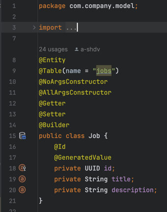
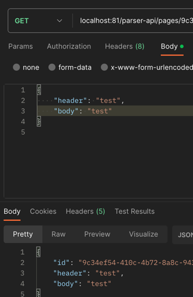

# Лабораторная работа №3 - REST API, Gateway и синхронный обмен между микросервисами
Цель:

Изучение шаблона проектирования gateway, построения синхронного обмена между микросервисами и архитектурного стиля RESTful API.

Задачи:

Создать 2 микросервиса, реализующих CRUD на связанных сущностях. Реализовать механизм синхронного обмена сообщениями между микросервисами. Реализовать шлюз на основе прозрачного прокси-сервера nginx.

## Демонстрация работы программы
### Сервис Aggregator
<u>POST-метод для создания вакансии</u>

<u>GET-метод для получения вакансии по id</u>

<u>GET-метод для получения списка вакансий</u>

<u>PUT-метод для обновления вакансии</u>

<u>DELETE-метод для удаления вакансии</u>

### Сервис Parser
<u>POST-метод для создания страницы</u>

<u>GET-метод для получения списка страниц</u>

<u>GET-метод для получения страницы по id</u>

<u>PUT-метод для изменения страницы</u>

<u>DELETE-метод для удаления страницы по ID</u>

### Метод, связывающий оба микросервиса
